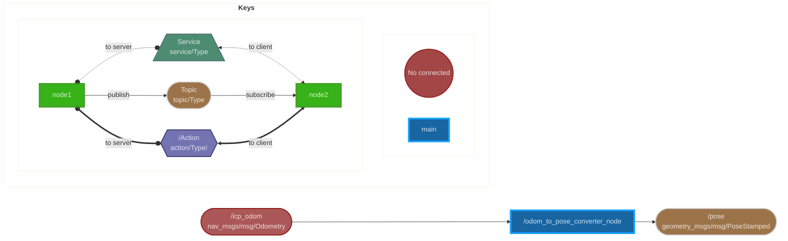

# odom_to_pose_converter
A node for converting nav_msgs/Odometry messages to geometry_msgs/PoseStamped messages.

```mermaid
flowchart LR

/odom_to_pose_converter_node[ /odom_to_pose_converter_node ]:::main
%% /wiln_node[ /wiln_node ]:::node
/icp_odom([ /icp_odom<br>nav_msgs/msg/Odometry ]):::bugged
/pose([ /pose<br>geometry_msgs/msg/PoseStamped ]):::topic


/icp_odom --> /odom_to_pose_converter_node
%% /pose --> /wiln_node
/odom_to_pose_converter_node --> /pose


subgraph keys[<b>Keys<b/>]
subgraph nodes[<b><b/>]
topicb((No connected)):::bugged
main_node[main]:::main
end
subgraph connection[<b><b/>]
node1[node1]:::node
node2[node2]:::node
node1 o-.-o|to server| service[/Service<br>service/Type\]:::service
service <-.->|to client| node2
node1 -->|publish| topic([Topic<br>topic/Type]):::topic
topic -->|subscribe| node2
node1 o==o|to server| action{{/Action<br>action/Type/}}:::action
action <==>|to client| node2
end
end
classDef node opacity:0.9,fill:#2A0,stroke:#391,stroke-width:4px,color:#fff
classDef action opacity:0.9,fill:#66A,stroke:#225,stroke-width:2px,color:#fff
classDef service opacity:0.9,fill:#3B8062,stroke:#3B6062,stroke-width:2px,color:#fff
classDef topic opacity:0.9,fill:#852,stroke:#CCC,stroke-width:2px,color:#fff
classDef main opacity:0.9,fill:#059,stroke:#09F,stroke-width:4px,color:#fff
classDef bugged opacity:0.9,fill:#933,stroke:#800,stroke-width:2px,color:#fff
style keys opacity:0.15,fill:#FFF
style nodes opacity:0.15,fill:#FFF
style connection opacity:0.15,fill:#FFF
```

